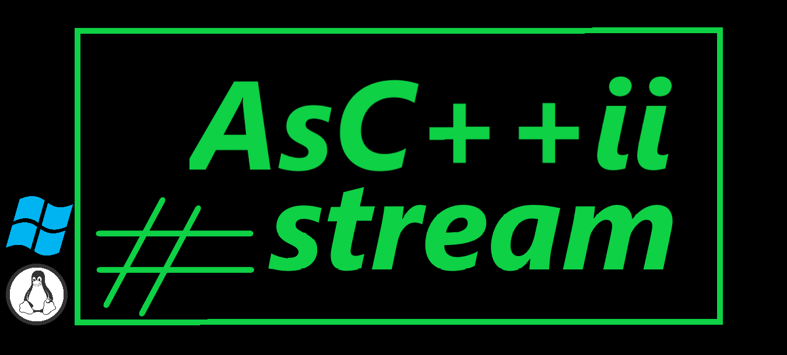

Данное ПО представляет собой сервер для потоковой передачи ASCII-графики через WebSocket с веб-интерфейсом

# Инструкция по запуску CMake

## Описание

Этот проект использует CMake для управления сборкой. Следуйте приведенным ниже инструкциям, чтобы собрать и запустить проект на вашей машине.

# (OS Windows)

## Требования

Перед началом убедитесь, что у вас установлены следующие инструменты:

- [CMake](https://cmake.org/download/) (версия 3.15 или выше)
- [Visual Studio](https://visualstudio.microsoft.com/) (или другой компилятор C++)
- [vcpkg](https://github.com/microsoft/vcpkg) для управления зависимостями

Установите необходимые библиотеки через vcpkg:
- ./vcpkg install opencv
- ./vcpkg install boost
- ./vcpkg install nlohmann-json
- ./vcpkg install gtest

## Сборка проекта через build.bat

Откройте cmd и запустите build.bat. Можно Указать параметры:
- tests--ON (для включения тестов)
- config--Debug (для сборки в режиме Debug)

После успешной сборки исполняемый файл server.exe будет находиться в директории build/Release (или build/Debug).
Если тесты были включины, то tests.exe будет находиться в этой же папке.

# (OS Linux)

## Требования

Перед началом убедитесь, что у вас установлены следующие инструменты:

- CMake (версия 3.15 или выше) - sudo apt install cmake
- GCC/G++ - sudo apt install build-essential

Установите необходимые библиотеки через пакетный менеджер:
- sudo apt update
- sudo apt install -y \
    libopencv-dev \
    libboost-system-dev \
    libboost-thread-dev \
    nlohmann-json3-dev \
    libspdlog-dev \
    libgtest-dev \
    libgmock-dev

## Сборка проекта через build.ыр

Откройте терминал и запустите build.sh. Можно Указать параметры:
- tests--ON (для включения тестов)
- config--Debug (для сборки в режиме Debug)

После успешной сборки исполняемый файл server будет находиться в директории build.
Если тесты были включены, исполняемый файл тестов tests будет находиться в папке build_tests.

## Сборка проекта вручную

1. Создайте директорию для сборки:
    mkdir build
    cd build 

2. Запустите CMake для генерации файлов сборки:
    cmake ..
- Можно использовать флаг -DBUILD_TESTS=ON для включения тестов в сборку:
    cmake -DBUILD_TESTS=ON

3.  Соберите проект:
    cmake --build . --config Release

После успешной сборки исполняемый файл server.exe будет находиться в директории build/Release.
Если тесты были включины, то tests.exe будет находиться в этой же папке.

## Сборка тестов

1. Перейдите в папку tests. Создайте директорию для сборки:
    mkdir build_tests
    cd build_tests 

2. Запустите CMake:
    cmake ..

3.  Соберите проект:
    cmake --build . --config Release

После успешной сборки исполняемый файл с тестами tests.exe будет находиться в директории build_tests/Release.
